# Architecture

Status: proposed. The repository contains design and validation tooling only. Component names are proposed Python module boundaries, not existing APIs.

```mermaid
flowchart LR
  F[Human supplied exported files] --> R[Source reader]
  R --> S[Immutable private snapshot]
  S --> C[Resolver and audit]
  S --> B[Backup service and restore receipts]
  C --> E[Experiment manager and journal]
  V[Photos and measurements] --> Q[Evidence pipeline]
  Q --> D[Isolated diagnostic worker]
  D --> P[Deterministic policy]
  B --> P
  E --> P
  P --> W[Offline candidate staging]
  W --> X[Isolated slicer worker]
  X --> H[Human artifact review]
  H --> A[Approval validator]
  A --> O[Local immutable export]
  O --> M[Human import activation and print]
  M --> V
```

The final human node is outside Rookery. There is no software edge from the product to a printer control interface. A Mermaid edge indicates data flow, not shared process permissions.

## Modules and Capabilities

| Module | Allowed inputs/output | Authority and boundary |
| --- | --- | --- |
| `sources` | Explicit exported files, approved roots -> raw snapshot descriptors | Read handles only; no discovery scans, remote mounts, profile writes, or config execution |
| `resolve` | Snapshot -> graph/effective settings/provenance/audit | No I/O outside content store; no Jinja evaluation or subprocess |
| `experiments` | Validated records -> append-only events/materialized views | Own private journal; only enumerated transitions; no external machine actions |
| `evidence` | Private captures -> deterministic frames/annotations/measurements | Bounded media decoder process; sanitized diagnostic derivatives; cannot call models implicitly |
| `diagnostics` | Approved diagnostic bundle -> untrusted DiagnosticReport | Replay first; model has no tools, credentials, filesystem writes, or shell. Separate API broker later permits only opted-in provider |
| `policy` | Versioned policy + typed inputs -> allow/deny/manual findings | Deterministic; protected-key denylist plus positive parameter allowlist; model cannot change policy |
| `backups` | Immutable originals -> destination copies/verified receipts | Separate credential broker, approved backup destinations only; no printer mounts or approval credentials |
| `candidates` | Validated structured change + current backup verdict -> staged bytes | Dedicated staging root, handle-based containment, no arbitrary path/writer/script interface |
| `slicer` | Approved dependencies/geometry + fixed argv -> inert raw artifact | Disposable worker, no network/devices/live profiles/cloud sync/plugins/post-processors; output staged then reviewed |
| `approvals` | Local human record or verified GitHub evidence -> authorization verdict | Credentials unavailable to model/slicer/automation author; deny mismatches and stale/forged reviews |
| `cli`, later UI/plugin | Requests to same core + reports | No duplicate policy implementation or direct device/network bypass |

One application, one local journal, separate restricted worker processes only where a trust boundary requires them. A plain subprocess, virtual environment, or Python type annotation is not a security boundary.

## Isolation and Enforcement

Phase 1 uses synthetic imported fixtures with no device access or network client. Before processing arbitrary files or running an actual slicer, implement and test an OS-enforced worker boundary (disposable VM or comparably constrained worker): printer/LAN/loopback control traffic denied; no USB/serial/device passthrough, named pipes or firmware sockets; restricted account; no live roots, host home directories, sync folders, shared credentials, shell escape, or privileged mounts. A Windows deployment must prove these properties; an ordinary Windows process or WSL instance with host access does not qualify by name alone.

The controller exposes bounded messages, not arbitrary argv, URLs, paths, Python code, G-code commands, or file replacements. Input/output schema and byte/resource limits are enforced on both sides. Trusted launch code is distinct from the advisory model and never delegates its shell. An isolated provider broker holds only provider credentials and a reviewed egress allowlist. No printer client is linked into an AI/slicer worker.

## Resolution and Storage

Store original bytes and encoding/newline metadata before parsing; hash bytes with SHA-256. Resolve only within granted roots after canonicalization and handle-level containment checks. Reject reparse/symlink/hardlink escapes, case-colliding destinations, NTFS alternate streams, absolute/UNC/device paths, archive traversal, cycles, duplicate/ambiguous settings, partial reads, and unbounded expansion. Capture before/after metadata plus rehash entire dependency closure; any drift yields an incomplete snapshot, not a reusable backup base.

Orca adapter tracks system/user inheritance, printer/filament/process dependencies, object/plate/project overrides, substitutions and toolchain defaults. Klipper adapter preserves include order/globs, save-config content, saved variables, macro text, and unknown sections. A stock INI parser is not presumed lossless or semantically equivalent to Klipper. Source files, loaded firmware observations, runtime overrides, and artifact commands are separate layers. Missing precedence evidence yields unresolved provenance.

Private store layout proposal: `objects/sha256/<digest>`, immutable record JSON, human report Markdown, receipts, and SQLite journal/index outside Git. New bytes are written to unique temporary objects, verified and flushed, then atomically published where the filesystem supports it. SQLite records reference durable verified objects; crashes leave unreferenced objects for quarantined recovery, never partially authorized records. Multi-file packages publish via one immutable manifest pointer; multiple file renames are not described as an atomic deployment.

Events include sequence, previous-event digest, canonical payload digest, actor, time, operation ID, and referenced immutable records. Updates create revisions, not edits. SQLite is a rebuildable index; externally anchored receipt/checkpoint copies can detect local alteration. A writable hash chain is not tamper-proof against an owner who can rewrite all copies.

## Future Moonraker Boundary (Phase 3, Disabled)

Use a separately deployed policy gateway with a fixed upstream identity. Only the gateway can reach Moonraker; credentials stay there. Workers and core cannot bypass it over IPv4/IPv6, localhost, alternate ports, WebSocket, Unix socket, proxy variables, redirects, or DNS changes. If that boundary cannot be enforced and adversarially tested, retain imported observations only.

Proposed operation/payload allowlist v0 (adapter returns filtered data):

| Operation | Permitted request | Response handling |
| --- | --- | --- |
| `printer.info` | No params; gateway emits only `GET /printer/info` | Keep state/software version; redact hostname/paths/process identity |
| `printer.objects.query` | Nonempty `objects` map; only `webhooks:[state]`, `print_stats:[state,print_duration,total_duration,filament_used]`, `pause_resume:[is_paused]`, `idle_timeout:[state]`, `gcode_move:[speed_factor,extrude_factor,homing_origin]`, `toolhead:[max_velocity,max_accel]`; any subset with exact field names | Gateway emits `POST /printer/objects/query` with structured JSON; no null/all-fields query; response projection; missing values unknown |

This allowlist intentionally cannot establish complete firmware activation. Imported loaded-config evidence is necessary if these observations are insufficient. Adding `configfile` or other fields requires a privacy/capability review and policy version change.

Documentation recheck during PR #14 review confirmed the listed fields in the [Klipper status reference](https://www.klipper3d.org/Status_Reference.html) and the request shapes in the [Moonraker printer API](https://moonraker.readthedocs.io/en/latest/external_api/printer/). `print_stats` depends on `virtual_sdcard`; its duration/material fields are reported estimates, not independent measurements of elapsed time or mass. Preserve that provenance. Missing objects/fields remain unknown and must not be synthesized or enabled by modifying the printer. This verifies documented names only, not an installed firmware version or gateway isolation.

Gateway accepts typed local operations, not raw HTTP/RPC forwarding. Unknown fields, duplicate JSON keys, JSON-RPC batches, notifications, arbitrary IDs/paths/query strings, method overrides, and oversized payloads fail closed. No WebSocket/subscription API in the initial design. An implementation exposing JSON-RPC must parse and validate individual methods/payloads before translation, never authorize `/jsonrpc` as a whole.

All other operations are denied, including upload/files, queues, power, restart, macros/G-code, emergency stop, and print management. A GET-only filter would not establish the required operation policy. [Moonraker's documented API](https://moonraker.readthedocs.io/en/latest/external_api/printer/) supports observations and control through the same service; our narrower interface is a proposed restriction, not an upstream read-only role.

## Failure and Recovery

Timeout, exhausted budget, model failure, missing evidence, backup failure, or staging interruption writes a failure event and freezes progression. Retries are bounded and idempotent by operation ID. Resume revalidates inputs, policy, evidence and approval; recovery never performs printer actions. Paused is not idle. Promotion changes only a recommendation pointer.
